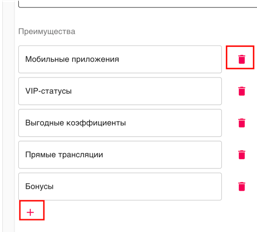
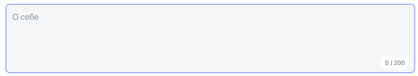

# Тестовое задание

## Technologies stack
- [React](https://reactjs.org/docs/getting-started.html)
- [Typescript](https://www.typescriptlang.org/docs/home.html)
- [Redux](https://redux.js.org/api/api-reference) или [Redux-Toolkit](https://redux-toolkit.js.org/), хороши бы было использовать RTK Query
- [A proposal for bundling reducers, action types and actions when using Redux](https://github.com/erikras/ducks-modular-redux) Хороший подход к организации слоя данных
- [Styled-components](https://styled-components.com/) | scss modules
- [Formik](https://formik.org/) | react final form
- [Yup](https://github.com/jquense/yup)

### Суть задачи

КЛОНИРУЕМ ПРОЕКТ, МЕНЯЕМ УДАЛЁННЫЙ РЕПОЗИТОРИЙ НА СВОЙ!!!

Реализовать форму отправки данных
Интерфейс:
`
{
    nickname: string,
    name: string,
    female: string,
    phone: string,
    email: string,
    sex: 'man' | 'woman',
    advantages: string[],
    radio: number,
    checkbox: number[],
    about: string
}
`

Дизайн свободный на Ваш вкус, но для оформления нуэно использовть `styled-components`.

В рамках дизайна формы рассмотреть 3 отдельных таба, которые можно переключать между собой, при переходе от таба к табу (в том числе возвращаясь на предыдущий) информация сохраняется

#### Валидация и описание полей

nickname - строковое значение, максимальная длина 30 символов, могут быть просто буквы и цифры (спец символы запрещены)

name - строковое значение, максимальная длина 50 символов, могут быть просто буквы

female - строковое значение, максимальная длина 50 символов, могут быть просто буквы

phone - строковое значение, форма записи +7 (900) 000-00-00 - реализовать маску ввода, +7, (), -, уже подставленные символы, валидация - цифры

email - строковое значение, валидация на email стандартная @ и .домен

sex - enum 'man' | 'woman' реализовать как select

advantages - массив строк, основной критерий - массив строк

пример блока, в дизайне должна быть кнопка добавления и удаления элемента

radio - number блок, в дизайне должна быть группа элементов RadioGroup

checkbox - массив number, в дизайне должна быть группа элементов CheckboxGroup

about - textarea блок максимальная длина 200 символов, в правом нижнем углу добавить счётчки символов без пробелов

Для установки бекенда можно запустить команду `api-install` или перейти в директорию api и установить пакеты, основное React приложение пустой Create ReactApp с надстройкой typescript.
Для минимальной реализации задачи нужно:
1. Реализовать 2 роута - /create-form и /form/:id
2. По роуту /create-form добавляем вышеописанную форму в 3 табах: 1 таб - nickname, name, female, sex, 2 таб - advantages, radio, checkbox, 3 таб - about. Кнопка должна быть задизейблена, пока все поляне будут заполнены
3. После отправки ответа и получения response, реализуем flow в редаксе, actions - отправка формы, получение response, response выводим в модалку и стилизуем (свободная форма)
4. /form/:id - id подставляем в заголовок h1, формата `Пользователь :id`, на ините странице идём на эндпойнт `/api/form/:id` забираем данные, складываем в store, забираем данные в компоненте и раскладываем по элементам (дизайн свободный) - формат дизайна описан выше

### Плюсы к прохождению задания
1. Использования lint и prettier в проекте и его настройка
2. Для валидации формы, использования formik и yup
3. Использование redux-toolkit
4. написание тестов на редюсеры, экшены и unit-тесты на компоненты
5. Наличие мобильной версии в вёрстке
6. Организация кода, структурирование компонентов, использование самописных хуков, осознанная структура компонентов, читаемость кода 
